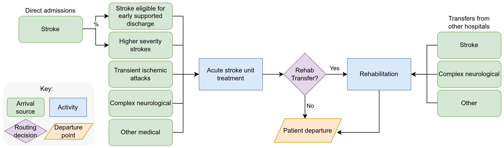
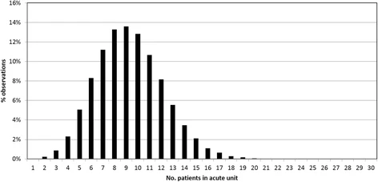
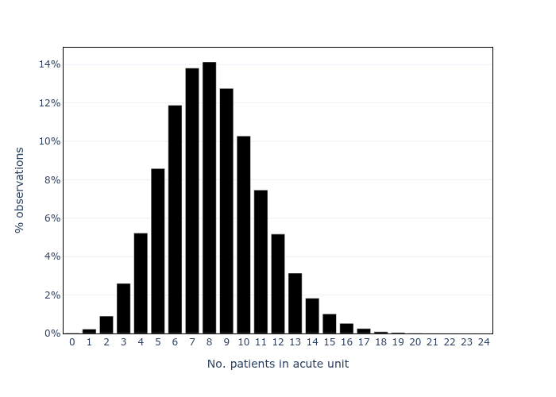
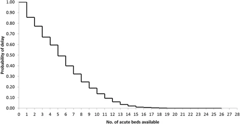
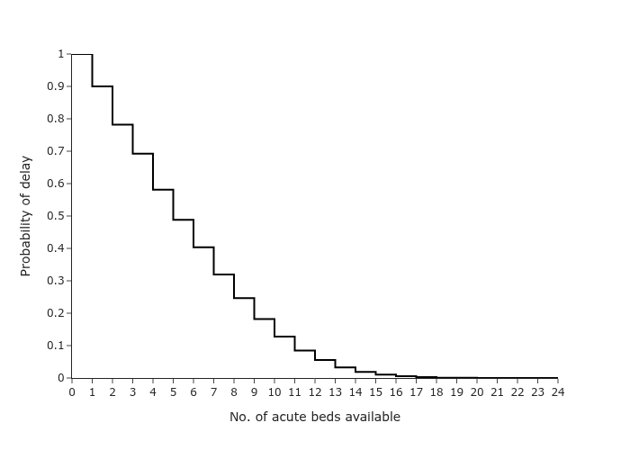

<div align="center">

# Stroke capacity planning model: python DES RAP

[](https://www.python.org/)

[](https://doi.org/10.5281/zenodo.15574906)
[](https://github.com/pythonhealthdatascience/pydesrap_stroke/actions/workflows/tests.yaml)
[](https://github.com/pythonhealthdatascience/pydesrap_stroke/actions/workflows/lint.yaml)
[](https://github.com/pythonhealthdatascience/pydesrap_stroke/actions/workflows/tests.yaml)

</div>

This repository provides a reproducible analytical pipeline (RAP) that implements a real-life stroke service capacity planning model in python. It serves as a practical example, fully reproducible and aligned with RAP principles, based on the following study:

> Monks T, Worthington D, Allen M, Pitt M, Stein K, James MA. A modelling tool for capacity planning in acute and community stroke services. BMC Health Serv Res. 2016 Sep 29;16(1):530. doi: [10.1186/s12913-016-1789-4](https://doi.org/10.1186/s12913-016-1789-4). PMID: 27688152; PMCID: PMC5043535.

Model diagram:



<br>

## Installation

Clone the repository locally:

```
git clone https://github.com/pythonhealthdatascience/pydesrap_stroke.git
cd pydesrap_stroke
```

Set up the Python environment using `conda` (recommended):

```
conda env create --file environment.yaml
conda activate
```

There is also a `requirements.txt` file which can be used to set up the environment with `virtualenv`, but this won't fetch a specific version of Python - so please note the version listed in `environment.yaml`.

<br>

## How to run

The simulation code is provided as a **package** within `simulation/`. There are notebooks executing the model and analysing the results in `notebooks/`.

To run the model with base parameters once or with replications:

```
from simulation import Param, Runner

param = Param()
runner = Runner(param=param)

single_result = runner.run_single(run=0)
rep_results = runner.run_reps()
```

Example altering the model parameters:

```
from simulation import Param, Runner

# Modify the number of replications
param = Param(number_of_runs=10)
runner = Runner(param=param)
rep_results = runner.run_reps()
```

### Generating the results from the article

The original study used Simul8. Each of the outputs from that article have been replicated in this repository using Python:

* Figure 1. Simulation probability density function for occupancy of an acute stroke unit.
* Figure 3. Simulated trade-off between the probability that a patient is delayed and the no. of acute beds available.
* Table 2. Likelihood of delay. Current admissions versus 5% more admissions.
* Table 3. Results of pooling of acute and rehab beds.
* Supplementary Table 1. Likelihood of delay. Current admissions versus No Complex neurological patients.
* Supplementary Table 3. Likelihood of delay. Current admissions versus ring fenced acute stroke beds.

To generate these, simply execute `notebooks/analysis.ipynb`.

#### Examples

**Figure 1**

Original:



From this repository:



**Figure 3**

Original:



From this repository:



<br>

## Run time and machine specification

The run time for this analysis (`notebooks/analysis.ipynb`) is 10 seconds. This was on an Intel Core i7-12700H, 32GB RAM, Ubuntu 24.04.1.

The other notebooks generate results for tests and illustrate other functionality (e.g. importing parameters from csv, running with logs), and these just take a second or two.

<br>

## Community

Curious about contributing? Check out the [contributing guidelines](CONTRIBUTING.md) to learn how you can help.

<br>

## Citation

For this applied example, please cite either:

> Heather, A. Monks, T. (2025). Stroke capacity planning model: python DES RAP. GitHub. https://github.com/pythonhealthdatascience/pydesrap_stroke.
>
> Heather, A. Monks, T. (2025). Stroke capacity planning model: python DES RAP. Zenodo. https://doi.org/10.5281/zenodo.15574906.

A `CITATION.cff` file is also provided.

**Contributors:**

**Amy Heather** - developed the repository.

* [](https://orcid.org/0000-0002-6596-3479)
* [](https://github.com/amyheather)

**Tom Monks** - peer review of the repository.

* [](https://orcid.org/0000-0003-2631-4481)
* [](https://github.com/TomMonks)

<br>

## Licence

MIT Licence. See `LICENSE` for details.

<br>

## Funding

This project was developed as part of the project STARS: Sharing Tools and Artefacts for Reproducible Simulations. It is supported by the Medical Research Council [grant number [MR/Z503915/1](https://gtr.ukri.org/projects?ref=MR%2FZ503915%2F1)].
