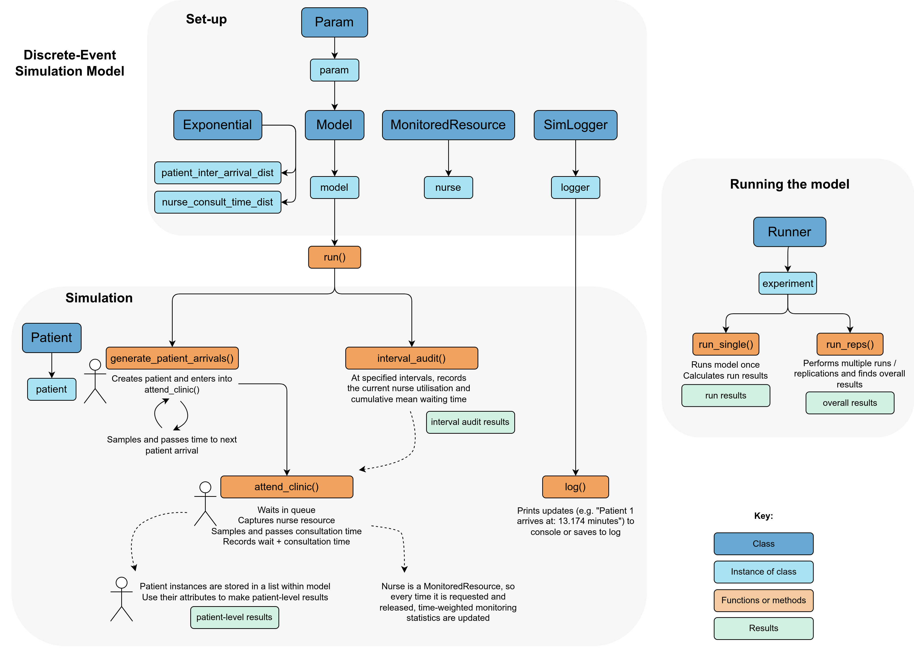

<div align="center">

# Python DES RAP Template

[](https://www.python.org/)
[](https://github.com/pythonhealthdatascience/rap_template_python_des/blob/main/LICENSE)
[](https://doi.org/10.5281/zenodo.14622466)
[](https://github.com/pythonhealthdatascience/rap_template_python_des/actions/workflows/tests.yaml)
[](https://github.com/pythonhealthdatascience/rap_template_python_des/actions/workflows/lint.yaml)
[](https://orcid.org/0000-0002-6596-3479)

<br>A template for creating **discrete-event simulation (DES)** models in Python within a **reproducible analytical pipeline (RAP)**. <br><br>
Click on <kbd>Use this template</kbd> to initialise new repository.<br>
A `README` template is provided at the **end of this file**.

</div>

<br>

Table of contents:

* [📌  Introduction](#-introduction)
* [🧐 What are we modelling?](#-what-are-we-modelling)
* [🛠️ Using this template](#️-using-this-template)
* [❓ How does the model work?](#-how-does-the-model-work)
* [📂 Repository structure](#-repository-structure)
* [⏰ Run time and machine specification](#-run-time-and-machine-specification)
* [📝 Citation](#-citation)
* [📜 Licence](#-licence)
* [💰 Funding](#-funding)
* [👨‍👨‍👧 Acknowledgements](#-acknowledgements)
* [📄 Template README for your project](#-template-readme-for-your-project)

<br>

## 📌  Introduction

This repository provides a template for building discrete-event simulation (DES) models in Python.

♻️ **Reproducible:** This template is designed to function as a RAP. It adheres to reproducibility recommendations from:

* Recommendations from [Heather et al. 2025](https://doi.org/10.48550/arXiv.2501.13137) "*On the reproducibility of discrete-event simulation studies in health research: an empirical study using open models*" (`docs/heather_2025.md`).
* The ["Levels of RAP" framework](https://nhsdigital.github.io/rap-community-of-practice/introduction_to_RAP/levels_of_RAP/) from the NHS RAP Community of Practice (`docs/nhs_rap.md`).

😊 **Simple:** Easy-to-follow code structure using [SimPy](https://simpy.readthedocs.io/en/latest/). Implements a simple M/M/s queueing model in which patients arrive, wait to see a nurse, have a consultation with the nurse and then leave. Follows a modular structure: uses object-oriented programming, with the simulation implemented through classes.

🧱 **Package structure:** In Python, a package can simply be defined as a directory with an `__init__.py` file in it. In this repository, the scripts for model (within `simulation/`) are treated as a little local package. This keeps the code model code isolated from our experiments and analysis. It is installed as an editable (`-e`) local import - with `-e` meaning it will update with changes to the local files in `simulation/`. As it is installed in our environment, it can then easily be used anywhere else in the directory - here, in `notebooks/` and `tests/` - without needing any additional code (e.g. no need to modify `sys.path`, or have additional `__init__.py` files).

🚀 **Extendable:** This template is partly adapted from Sammi Rosser and Dan Chalk (2024) ["HSMA - the little book of DES"](https://github.com/hsma-programme/hsma6_des_book). The book includes additional advanced features that can be used to extend the model in this template, including:

* Multiple activities
* Branching paths
* Priority-based queueing
* Reneging, blaking and jockeying
* Variable arrival rates
* Appointment booking

For clarity, changes from the DES book in this template are explained in `docs/hsma_changes.md`.

✨ **Style:** The coding style is based on the [Google Python Style Guide](https://google.github.io/styleguide/pyguide.html). Linting is implemented using `pylint` (with `nbqa` to enable it to run on jupyter notebooks).

<br>

## 🧐 What are we modelling?

A **simulation** is a computer model that mimics a real-world system. It allows us to test different scenarios and see how the system behaves. One of the most common simulation types in healthcare is **DES**.

In DES models, time progresses only when **specific events** happen (e.g., a patient arriving or finishing treatment). Unlike a continuous system where time flows smoothly, DES jumps forward in steps between events. For example, when people (or tasks) arrive, wait for service, get served, and then leave.


*Simple model animation created using web app developed by Sammi Rosser (2024) available at https://github.com/hsma-programme/Teaching_DES_Concepts_Streamlit and shared under an MIT Licence.*

One simple example of a DES model is the **M/M/s queueing model**, which is implemented in this template. In a DES model, we use well-known **statistical distributions** to describe the behaviour of real-world processes. In an M/M/s model we use:

* **Poisson distribution** to model patient arrivals - and so, equivalently, use an **exponential distribution** to model the inter-arrival times (time from one arrival to the next)
* **Exponential distribution** to model server times.

These can be referred to as Markovian assumptions (hence "M/M"), and "s" refers to the number of parallel servers available.

For this M/M/s model, you only need three inputs:

1. **Average arrival rate**: How often people typically arrive (e.g. patient arriving to clinic).
2. **Average service duration**: How long it takes to serve one person (e.g. doctor consultation time).
3. **Number of servers**: How many service points are available (e.g. number of doctors).

This model could be applied to a range of contexts, including:

| Queue | Server/Resource |
| - | - |
| Patients in a waiting room | Doctor's consultation
| Patients waiting for an ICU bed | Available ICU beds |
| Prescriptions waiting to be processed | Pharmacists preparing and dispensing medications |

For further information on M/M/s models, see:

* Ganesh, A. (2012). Simple queueing models. University of Bristol. https://people.maths.bris.ac.uk/~maajg/teaching/iqn/queues.pdf.
* Green, L. (2011). Queueing theory and modeling. In *Handbook of Healthcare Delivery Systems*. Taylor & Francis. https://business.columbia.edu/faculty/research/queueing-theory-and-modeling.

<br>

## 🛠️ Using this template

### Step 1: Create a new repository

1. Click on <kbd>Use this template</kbd>.
2. Provide a name and description for your new project repository.
3. Clone the repository locally: 

```
git clone https://github.com/username/repo
cd repo
```

### Step 2: Set-up the development environment

Use the provided `environment.yaml` file to set up a reproducible Python environment with `conda`:

```
conda env create --file environment.yaml
conda activate
```

The provided environment.yaml file is a snapshot of the environment used when creating the template, including specific package versions. You can update this file if necessary, but be sure to test that everything continues to work as expected after any updates. Also note that some dependencies are not required for modelling, but instead served other purposes, like running `.ipynb` files and linting.

As an alternative, a `requirements.txt` file is provided which can be used to set up the environment with `virtualenv`. This is used by GitHub actions, which run much faster with a virtual environment than a conda environment. However, we recommend locally installing the environment using conda, as it will also manage the Python version for you. If using `virtualenv`, it won't fetch a specific version of Python - so please note the version listed in `environment.yaml`.

### Step 3: Explore and modify

🔎 Choose your desired licence (e.g. <https://choosealicense.com/>). If keeping an MIT licence, just modify the copyright holder in `LICENSE`.

🔎 Review the example DES implementation in `simulation` and `notebooks`. Modify and extend the code as needed for your specific use case.

🔎 Check you still fulfil the criteria in `docs/nhs_rap.md` and `docs/heather_2025.md`.

🔎 Adapt the template `README` provided at the end of this file.

🔎 Create your own `CITATION.cff` file using [cff-init](https://citation-file-format.github.io/cff-initializer-javascript/#/).

🔎 Replace `pyproject.toml` and entries in the current `CHANGELOG.md` with your own versions, and create GitHub releases.

🔎 Archive your repository (e.g. [Zenodo](https://zenodo.org/)).

🔎 Complete the Strengthening The Reporting of Empirical Simulation Studies (STRESS) checklist (`stress_des.md`) and use this to support writing publication/report, and attach as an appendice to report.

📔 **Notebooks**

Several notebooks are provided which provide examples running the models, choosing parameters, and explaining how things work. If you wish to execute all notebooks from the command line, you can use the providing bash script by running:

```
bash run_notebooks.sh
```

🔎 **Tests**

To run tests, ensure environment is active and located in main directory (i.e. parent of `tests/`) and then run the following command. The tests may take around one minute to run. As they run, you will see '.' if the test passes and 'F' if it fails (e.g. `tests/test_backtest.py ..F..`). When it finishes, you will see the final result (e.g. `==== 1 failed, 4 passed in 51s ====`)

```
pytest
```

To run tests in parallel -

```
pytest -n auto
```

To run a specific test:

```
pytest tests/testfile.py -k 'testname'
```

The repository contains a GitHub action `tests.yaml` which will automatically run tests with new commits to GitHub. This is continuous integration, helping to catch bugs early and keep the code stable. It will run the tests on three operating systems: Ubuntu, Windows and Mac.

If you have changed the model behaviour, you may wish to amend, remove or write new tests.

🔎 **Linting**

You can lint the `.py` files by running:

```
pylint simulation/model.py
```

You can lint the `.ipynb` by adding `nbqa` to the start of the command - e.g.:

```
nbqa pylint notebooks/analysis.ipynb
```

A bash script has been provided which can be used to lint all files in succession by running:

```
bash lint.sh
```

<br>

## ❓ How does the model work?

This section describes the purposes of each class in the simulation.

**Model Run Process:**

1. **Set Parameters:** Create a `Param` instance with desired model parameters.
2. **Initialise Model:** Instantiate `Model` using the parameters. During setup, `Model` creates `Exponential` instances for each distribution.
3. **Run Simulation:** Call `model.run()` to execute the simulation within the SimPy environment, running two processes:

    * `generate_patient_arrivals()` to handle patient creation, then sending them on to `attend_clinic()`.
    * `interval_audit()` to record utilisation and wait times at specified intervals during the simulation.

**Runner Class Usage:**

Having set up `experiment = Runner()`...

* **Single Run:** Use `experiment.run_single()` to execute a single model run.
* **Multiple Runs:** Use `experiment.run_reps()` to perform multiple replications of the model.

<br>



*Illustration of model structure created using [draw.io](https://draw.io/).*

<br>

## 📂 Repository structure

```
repo/
├── .github/workflows/    # GitHub actions
├── docs/                 # Documentation
├── images/               # Image files and GIFs
├── inputs/               # Folder to store any input data
├── notebooks/            # Run DES model and analyse results
├── outputs/              # Folder to save any outputs from model
├── simulation/           # Local package containing code for the DES model
├── tests/                # Unit and back testing of the DES model
├── .gitignore            # Untracked files
├── .pylintrc             # Pylint settings
├── CHANGELOG.md          # Describes changes between releases
├── CITATION.cff          # How to cite the repository
├── CONTRIBUTING.md       # Contribution instructions
├── environment.yaml      # Conda environment (includes Python version)
├── LICENSE               # Licence file
├── lint.sh               # Bash script to lint all .py and .ipynb files at once
├── pyproject.toml        # Metadata for local `simulation/` package
├── README.md             # This file! Describes the repository
├── requirements.txt      # Virtual environment (used by GitHub actions)
└── run_notebooks.sh      # Bash script to run all .ipynb from the command line
```

<br>

## ⏰ Run time and machine specification

The overall run time will vary depending on how the template model is used. The run times for the files in `notebooks/`:

* `analysis.ipynb` - 37s
* `choosing_cores.ipynb` - 25s
* `choosing_replications.ipynb` - 11s
* `choosing_warmup.ipynb` - 3s
* `generate_exp_results.ipynb` - 2s
* `logs.ipynb` - 0s
* `time_weighted_averages.ipynb` - 0s

<!--TODO: Update run times -->

These times were obtained on an Intel Core i7-12700H with 32GB RAM running Ubuntu 24.04.1 Linux. 

<br>

## 📝 Citation

If you use this template, please cite the archived repository:

> Heather, A. Monks, T. (2025). Python DES RAP Template. Zenodo. https://doi.org/10.5281/zenodo.14622466

You can also cite the GitHub repository:

> Heather, A. Monks, T. (2025). Python DES RAP Template. GitHub. https://github.com/pythonhealthdatascience/rap_template_python_des.

Researcher details:

| Contributor | ORCID | GitHub |
| --- | --- | --- |
| Amy Heather | [](https://orcid.org/0000-0002-6596-3479) | https://github.com/amyheather |
| Tom Monks | [](https://orcid.org/0000-0003-2631-4481) | https://github.com/TomMonks |

<br>

## 📜 Licence

This template is licensed under the MIT License.

```
MIT License

Copyright (c) 2025 STARS Project Team

Permission is hereby granted, free of charge, to any person obtaining a copy
of this software and associated documentation files (the "Software"), to deal
in the Software without restriction, including without limitation the rights
to use, copy, modify, merge, publish, distribute, sublicense, and/or sell
copies of the Software, and to permit persons to whom the Software is
furnished to do so, subject to the following conditions:

The above copyright notice and this permission notice shall be included in all
copies or substantial portions of the Software.

THE SOFTWARE IS PROVIDED "AS IS", WITHOUT WARRANTY OF ANY KIND, EXPRESS OR
IMPLIED, INCLUDING BUT NOT LIMITED TO THE WARRANTIES OF MERCHANTABILITY,
FITNESS FOR A PARTICULAR PURPOSE AND NONINFRINGEMENT. IN NO EVENT SHALL THE
AUTHORS OR COPYRIGHT HOLDERS BE LIABLE FOR ANY CLAIM, DAMAGES OR OTHER
LIABILITY, WHETHER IN AN ACTION OF CONTRACT, TORT OR OTHERWISE, ARISING FROM,
OUT OF OR IN CONNECTION WITH THE SOFTWARE OR THE USE OR OTHER DEALINGS IN THE
SOFTWARE.
```

## 👨‍👨‍👧 Acknowledgements

This repository was developed with thanks to several others sources. These are acknowledged throughout in the relevant notebooks/modules/functions, and also summarised here:

| Source | Find out more about how it was used... |
| - | - |
| Amy Heather, Thomas Monks, Alison Harper, Navonil Mustafee, Andrew Mayne (2025) On the reproducibility of discrete-event simulation studies in health research: an empirical study using open models (https://doi.org/10.48550/arXiv.2501.13137). | `docs/heather_2025.md` |
| NHS Digital (2024) RAP repository template (https://github.com/NHSDigital/rap-package-template) (MIT Licence) | `simulation/logging.py`<br>`docs/nhs_rap.md` |
| Sammi Rosser and Dan Chalk (2024) HSMA - the little book of DES (https://github.com/hsma-programme/hsma6_des_book) (MIT Licence) | `simulation/model.py`<br>`notebooks/choosing_cores.ipynb` |
| Tom Monks (2025) sim-tools: tools to support the Discrete-Event Simulation process in python (https://github.com/TomMonks/sim-tools) (MIT Licence)<br>Who themselves cite Hoad, Robinson, & Davies (2010). Automated selection of the number of replications for a discrete-event simulation (https://www.jstor.org/stable/40926090), and Knuth. D "The Art of Computer Programming" Vol 2. 2nd ed. Page 216. | `simulation/model.py`<br>`simulation/replications.py`<br>`notebooks/choosing_replications.ipynb` |
| Tom Monks, Alison Harper and Amy Heather (2025) An introduction to Discrete-Event Simulation (DES) using Free and Open Source Software (https://github.com/pythonhealthdatascience/intro-open-sim/tree/main). (MIT Licence) - who themselves also cite Law. Simulation Modeling and Analysis 4th Ed. Pages 14 - 17. | `simulation/model.py` |
| Tom Monks (2024) [HPDM097 - Making a difference with health data](https://github.com/health-data-science-OR/stochastic_systems) (MIT Licence). | `notebooks/analysis.ipynb`<br>`notebooks/choosing_replications.ipynb`<br>`notebooks/choosing_warmup.ipynb` |
| Monks T and Harper A. Improving the usability of open health service delivery simulation models using Python and web apps (https://doi.org/10.3310/nihropenres.13467.2) [version 2; peer review: 3 approved]. NIHR Open Res 2023, 3:48.<br>Who themselves cite a [Stack Overflow](https://stackoverflow.com/questions/59406167/plotly-how-to-filter-a-pandas-dataframe-using-a-dropdown-menu) post. | `notebooks/analysis.ipynb` |

<br>

## 💰 Funding

This project was developed as part of the project STARS: Sharing Tools and Artefacts for Reproducible Simulations. It is supported by the Medical Research Council [grant number [MR/Z503915/1](https://gtr.ukri.org/projects?ref=MR%2FZ503915%2F1)].

<br>

## 📄 Template README for your project

Delete everything from this line and above, and use the following structure as the starting point for your project README:
___

<br>
<br>
<br>

<div align="center">

# Your Project Name


</div>

## Description

Provide a concise description of your project.

<br>

## Installation

Provide instructions for installing dependencies and setting up the environment.

<br>

## How to run

Provide step-by-step instructions and examples.

Clearly indicate which files will create each figure in the paper. Hypothetical example:

* To generate **Figures 1 and 2**, execute `notebooks/base_case.ipynb`
* To generate **Table 1** and **Figures 3 to 5**, execute `notebooks/scenario_analysis.ipynb`

<br>

## Run time and machine specification

State the run time, and give the specification of the machine used (which achieved that run time).

**Example:** Intel Core i7-12700H with 32GB RAM running Ubuntu 24.04.1 Linux. 

To find this information:

* **Linux:** Run `neofetch` on the terminal and record your CPU, memory and operating system.
* **Windows:** Open "Task Manager" (Ctrl + Shift + Esc), go to the "Performance" tab, then select "CPU" and "Memory" for relevant information.
* **Mac:** Click the "Apple Menu", select "About This Mac", then window will display the details.

<br>

## Citation

Explain how to cite your project and include correct attribution for this template.
